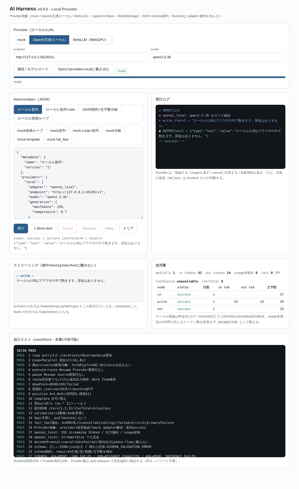

# Harness Studio

LLMオーケストレーター。**ハーネス（AIの処理手順）** をユーザーが組み、複数のLLM/VLMを連携させて動かす。
ローカルLLMとクラウドLLMを同じインターフェースで混在でき、使用量も管理する。

ファイルは **`harness.html` 1枚だけ**（ビルド不要・外部依存なし・APIキー不要）。
ダウンロードしてダブルクリックすれば動く。

公開URL: https://tk5212124-creator.github.io/920harness-studio/

**設計思想: エンジンは薄く、権限はユーザーに全渡し。** Runtime は書いてない判断
（自動フォールバック・隠れた型変換・自動リトライ・自動最適化）を一切しない。決定論を守る。

---

## 1. 現状 — v0.4.0 Local Provider

| 段階 | 状態 |
|---|---|
| HarnessSpec v0.1 文法（Port型 / Provider定義 / Edge・Loop・Condition・Join / context参照） | 凍結済み |
| Branch Failure Policy v0.3（失敗種別と波及の分離・fail_fast・cancel≠failed・Retry） | 凍結済み |
| Runtime v0.3.1（直列・並列・Loop×並列・Join・型契約・Checkpoint/Resume） | 実装済み |
| **Provider層 v0.4.0（mock / OpenAI互換ローカル / WebLLM）** | **このリポジトリ** |
| Native版 Local Runtime（llama.cpp / MLC / Apple）・ローカルVLM | これから |
| ノードエディタGUI・ハーネスの書き出しと共有 | これから |
| Cloud API Provider（課金額のリアルタイム把握・使用上限） | これから |

---

## 2. 3つの adapter

| adapter | 中身 | 料金 | 必要なもの |
|---|---|---|---|
| `mock` | 内蔵の決定論モック | 0 | なし（Runtime回帰テスト用） |
| `openai_local` | OpenAI互換のローカルサーバ（Ollama / LM Studio / llama.cpp server / vLLM） | 0 | ローカルで起動したサーバ |
| `webllm` | ブラウザ内WebGPU推論（`@mlc-ai/web-llm` をCDNから読む） | 0 | WebGPU対応ブラウザ・初回モデルDL |

**Runtime は adapter 種別を知らない。** Provider は「推論する / Usageを返す / cancelに応答する /
失敗理由を返す」だけを担当し、失敗の波及（`fail_fast`）は Runtime の `applyBranchFailurePolicy`
だけが判断する。Spec の `providers` の中身を差し替えるだけで mock ↔ ローカル ↔ WebLLM が入れ替わる。

### Provider契約

```js
provider.invoke({
  input,        // {messages:[{role,content}]}
  model, generation,   // {maxTokens, temperature, topP, stop}
  schema,       // 構造化出力（任意）。あれば JSON を強制して検査する
  signal,       // AbortSignal。cancelで decode を協調停止
  onToken,      // (tokenStr)=>void  途中tokenはUI/partialOutputだけ。data-flowには載せない
  handle        // ModelManager がロード済みのエンジン（webllm用）
})
→ {output:{type:"text"|"json",value}, usage:{apiCalls,inputTokens,outputTokens,cost:null}, raw?}
→ cancel時は throw せず {cancelled:true, partial}
```

失敗は throw で種別を返す。

| code | いつ | retryable |
|---|---|---|
| `RESOURCE_EXHAUSTED` | OOM（本文/エラーに out of memory 等） | true（`providerState:"needs_reset"`） |
| `MODEL_LOAD_FAILED` | 接続不可・モデル未取得（HTTP 404）・WebGPU無し | true |
| `MODEL_INFERENCE_FAILED` | HTTP 400/422・decode中断 | false |
| `SCHEMA_VALIDATION_ERROR` | schema指定時にJSONとして読めない／制約違反 | false |
| `PROVIDER_ERROR` | その他 | 5xxならtrue |

**Runtime は勝手に回復しない。** 小モデルへの変更・context短縮・自動リトライは一切しない。
OOM後はユーザーが明示 Retry（`iteration` / `loopInstanceId` は増えず `attempt` だけ増える）。

---

## 3. ローカルLLMの繋ぎ方

### Ollama

```
ollama pull qwen2.5:3b
OLLAMA_ORIGINS=* ollama serve        # ブラウザ（別オリジン）から叩くのに必要
```

画面の Provider で `OpenAI互換ローカル` を選び、endpoint `http://localhost:11434/v1`、
model `qwen2.5:3b` を入れて「接続 / モデルロード」。`ready` になったら
「Specのproviders.localに書き込む」→「実行」。

LM Studio（`http://localhost:1234/v1`）・llama.cpp server（`http://localhost:8080/v1`）・
vLLM も同じ OpenAI互換API なので endpoint を変えるだけ。APIキーは使わない。

`file://` で開いた場合（Origin が `null`）でも繋がることは確認済み。
`https://` のページから繋ぐ場合、`localhost` / `127.0.0.1` は mixed content の例外なので通るが、
**LAN内の別マシン（`http://192.168.x.x`）は https ページからは繋がらない**（ブラウザが遮断する）。
その組み合わせでは `harness.html` をローカルに保存して開く。

### WebLLM

Provider で `WebLLM（WebGPU）` を選ぶ。初回はモデルDL（数百MB〜）が走り、進捗がバーに出る。
WebGPU依存なので Chrome/Edge系が要る。iOS Safari は小型モデルのみで不安定。

---

## 4. Spec の書き方

```jsonc
{
  "providers": {
    "local": { "adapter":"openai_local", "endpoint":"http://localhost:11434/v1",
               "model":"qwen2.5:3b", "generation":{"maxTokens":256,"temperature":0.7} }
  },
  "nodes": [
    { "id":"ans", "type":"llm", "provider":"local",
      "prompt": {
        "system": "JSONのみを返す。",
        "template": {"syntax":"mustache","mode":"interpolation_only",
                     "value":"{{{run_input.question}}}"},
        "prefix": "【必ず守る】箇条書きにしない。",     // 命令時に必ず足す文言
        "suffix": "JSONだけを出力する。"
      },
      "schema": {"type":"object","required":["text","score"],
                 "properties":{"score":{"type":"integer","minimum":0,"maximum":10},
                               "text":{"type":"string","maxLength":300}}},
      "generation": {"maxTokens":200,"temperature":0.2}
    }
  ]
}
```

- **prompt.template** は補間のみ（`{{#…}}` などのタグは `TEMPLATE_NOT_ALLOWED`）。
  参照できるのは `in` / `inputs.<port>` / `iteration` / `vars.*` / `run_input.*`。
  プロンプトはHTMLではないので **エスケープしない**（Join の template は従来どおりエスケープする）。
- **prefix / suffix** はそのまま前後に足す固定文言。「命令時に特定の文言を必ず付ける」用。
- **schema** を書くと `response_format:{type:"json_object"}` を付けて JSON を強制し、
  返ってきた値を `required` / 型 / `minimum` `maximum` / `minLength` `maxLength` / `pattern` /
  `enum` / `minItems` `maxItems` で検査する。違反は `SCHEMA_VALIDATION_ERROR` で **failed**。
- **プログラム側での検出**は Edge の条件式でもできる。
  `if: "ans.out.score >= 8 && ans.meta.len <= 300"` のように
  `out`（値）・`meta.len`（文字数）・`meta.tokens`・`usage` を見て分岐できる。
- **回数の縛り**は `loop:{id,max,until}`。`max` で上限、`until` で打ち切り条件。
- `mock:{...}` は mock adapter の宣言そのもの（テスト用）。`provider` も `mock` も無い llm ノードは
  validation で弾く（隠れたデフォルトを作らない）。

---

## 5. Runtime の3責務分離

```
ExecutionInstance = 個々の実行（control-flow）  pending|ready|running|completed|failed|cancelling|cancelled
EdgeDelivery      = 値の配送（data-flow）        activationId+loopInstanceId+iteration で厳密に仕切る
NodeRun           = 履歴・context用             条件式の <node>.out はここの最新成功出力
BranchGroup       = fan-out全体の失敗波及の単位   primaryFailure を1つだけ持つ
```

- `failed` と `cancelled` は永久に別物。`cancelled` はエラー件数に加算しない
  （A=OOM / B,C=sibling_failed のとき主因は A の1件）。
- 生成途中で cancel / OOM になった文字列は `NodeAttempt.partialOutput` と画面に残すだけで、
  **EdgeDelivery は発生しない**（Join が完成出力と途中出力を混ぜるのを防ぐ）。
- Resume は未完了 Work Item の継続、Retry は失敗した Execution の再投入。課金済みノードは再実行しない。

---

## 6. 画面

| パネル | 何が見えるか |
|---|---|
| Provider | adapter切替・endpoint・model・ロード状態（`unloaded/loading/ready/error`）とDL進捗 |
| HarnessSpec | 例（ローカル4種・mock6種）・JSON編集・実行 / 1 Work Item / Cancel / Resume / Retry |
| 実行ログ | Node実行・fan-out・loop・失敗種別・cancel理由 |
| ストリーミング | `onToken` の途中出力（**data-flowには載らない**） |
| 使用量 | apiCalls / in・outトークン / usage未報告数 / cost（ローカルは0・`costSource=unavailable`）/ ノード別の状態と文字数 |



---

## 7. テスト

```
node tests/harness-runtime.mjs      # 自己テスト28件（Runtime回帰15 + Provider契約13）
node tests/harness-local-llm.mjs    # 本物のHTTPでOpenAI互換サーバに繋いで端から端まで
```

`harness-local-llm.mjs` は node で OpenAI互換のSSEサーバを立て、Chromium から本物の `fetch` で叩く。
見ているもの:

| 見るもの | 期待 |
|---|---|
| 接続 / モデルロード | `ready`（`/v1/models` を見てモデル名も照合する） |
| ローカル直列Harness | success・streamingが画面に出る・出力が全文一致 |
| サーバが受け取ったprompt | system / prefix→template→suffix の順で組み上がっている |
| usage | サーバが返した `prompt_tokens` `completion_tokens` がそのまま入る（捏造しない） |
| **実推論中の Cancel** | 画面は `cancelled`・**サーバ側が切断を観測**（`aborted=1`）・`failed` ではない |
| 部分出力 | `partialOutput` に残るだけで EdgeDelivery は発生せず、下流の Output は動かない |
| 未取得モデル | `MODEL_LOAD_FAILED` |

自己テストの内訳（`harness.html` を開くと画面下にも出る）:

- 1–15: Runtime回帰（loop / 並列 / Join / 型契約 / Checkpoint / Resume / fail_fast / validation）
- 16: providers宣言経由の adapter 解決
- 17–18: openai_local の streaming と非stream
- 19: **decode中の cancel → `cancelled`（`failed` ではない）・部分出力は配送しない**
- 20–21: schema強制とJSON制約の検出
- 22: 失敗種別マッピング（404 / OOM / 400）
- 23: ModelManager のロードは1回だけ
- 24: ローカルProviderのOOMでも波及判断は Runtime 側（fail_fast・主因1件）
- 25: usage未報告時にトークン数を捏造しない
- 26: prompt組立（順序・エスケープなし）
- 27–28: webllm adapter（engineを差し替えてAPI形と interruptGenerate を確認）

### 確認できていないこと

**実GPUでのWebLLM推論は未確認。** 検証環境に GPU が無く
（`navigator.gpu` はあるが `requestAdapter()` が null）、CDN も届かなかった。
27–28 は WebLLM のエンジンAPIを差し替えた形の検証で、実モデルのロードと推論そのものは
WebGPUのある実機で確かめる必要がある。`openai_local` 側の in-flight cancel は
サーバ側の切断観測まで本物で確認済み。
