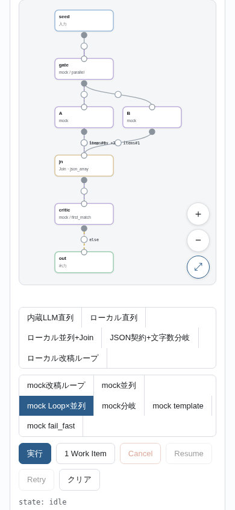
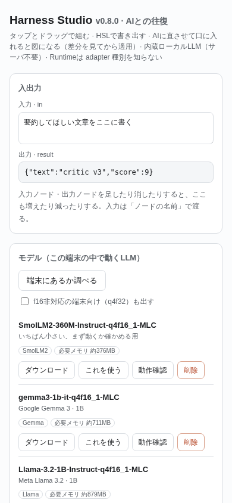
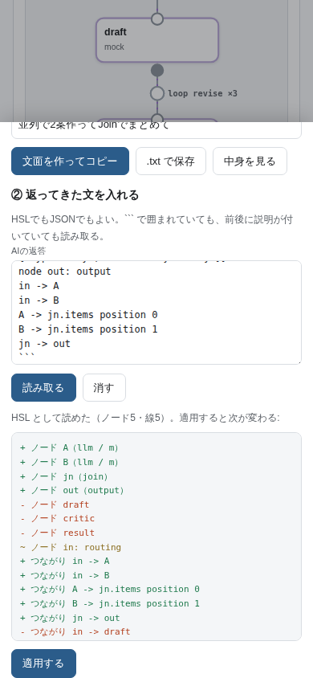
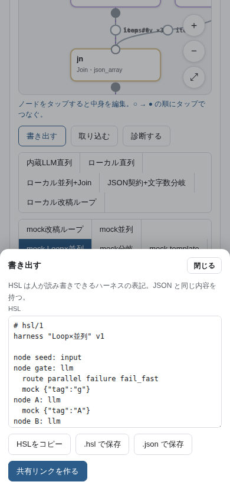
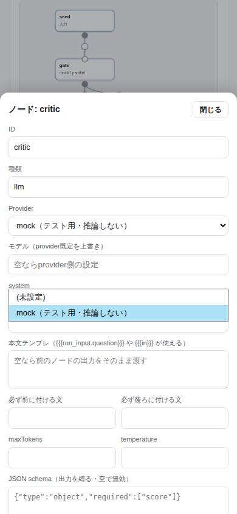

# Harness Studio

LLMオーケストレーター。**ハーネス（AIの処理手順）** を画面上でノードとして組み、
複数のLLM/VLMを連携させて動かす。ローカルLLMとクラウドLLMを同じインターフェースで混在できる。

**タップとドラッグで組める。** ノードを置き、ポートをタップしてつなぎ、ノードをタップして中身を決める。
iPhone でもPCでも同じ操作。

**組んだハーネスは言語（HSL）として書き出せる。** テキストなので人に渡せるし、リンク1本で別の端末でも開ける。

**構造を1枚のテキストにして外部のLLMに渡し、返ってきた文を口に入れるとノードと線になる。**
渡す1枚には文法もいまの構造も入っているので、**何も説明されていないLLMが初見で読んで書ける**ことを狙っている。
返答は ``` 付きでも前置き付きでもよく、貼ると**何が変わるかを見せてから**適用する。
アプリ自身がLLMを呼んで構造を考えることはしない（それは外部のLLMの仕事）。

**LLMをアプリに内蔵している。** サーバもAPIキーも要らず、ブラウザの中だけで推論する
（WebLLM/WebGPU。本体はこのリポジトリに同梱、モデルは初回だけ端末にDLして保存）。

公開URL: https://tk5212124-creator.github.io/920harness-studio/

**設計思想: エンジンは薄く、権限はユーザーに全渡し。** Runtime は書いてない判断
（自動フォールバック・隠れた型変換・自動リトライ・自動最適化）を一切しない。決定論を守る。

---

## 1. 現状 — v0.13.0 最初から本物のローカルLLM

| 段階 | 状態 |
|---|---|
| HarnessSpec v0.1 文法（Port型 / Provider定義 / Edge・Loop・Condition・Join / context参照） | 凍結済み |
| Branch Failure Policy v0.3（失敗種別と波及の分離・fail_fast・cancel≠failed・Retry） | 凍結済み |
| Runtime v0.3.1（直列・並列・Loop×並列・Join・型契約・Checkpoint/Resume） | 実装済み |
| Provider層 v0.4.0（mock / OpenAI互換ローカル / WebLLM） | 実装済み |
| 内蔵LLM v0.5.0（本体同梱・Worker実行・端末チェック・モデル常駐） | 実装済み |
| ノードエディタ v0.6.0（タップとドラッグで組む・実行状態を図に出す） | 実装済み |
| HSL・共有・診断 v0.7.0（言語で書き出す/取り込む・リンク共有・構造診断） | 実装済み |
| 外部LLMとの往復 v0.8.0（1枚を渡す→返答を口に入れると図になる。差分を見てから適用） | 実装済み |
| 入出力とモデル v0.9.0（入力/出力ノードに連動する欄・Gemma/Qwen/Llamaを端末に落とす） | 実装済み |
| ノードごとのモデルと合流 v0.10.0（ノード編集でモデルを選ぶ・1つの入口に複数の線を入れる） | 実装済み |
| 読める失敗とまとめ方 v0.11.0（失敗の理由を必ず文で出す・出たエラーをその場で直す・Joinのまとめ方と追加文言・線の形） | 実装済み |
| このサイトからモデルを配る v0.12.0（重みを GitHub Pages に載せる・HuggingFaceに行かずに落とせる） | 実装済み |
| **最初から本物のローカルLLM v0.13.0（既定が内蔵LLM・JSON強制の不具合修正・調査用の出力ボタン・実推論のCI）** | **いまここ** |
| Native版 Local Runtime（llama.cpp / MLC / Apple）・ローカルVLM | これから |

| Cloud API Provider（課金額のリアルタイム把握・使用上限） | これから |

---

## 2. ハーネスを組む（ノードエディタ）



| やりたいこと | 操作 |
|---|---|
| ノードを足す | **＋ノード** → 入力 / LLM / Join / 出力 を選ぶ。置いた直後に中身の編集が開く |
| ノードを動かす | ノードをドラッグ。座標は `metadata.layout` に入る（Runtimeは見ない） |
| **つなぐ** | つなぎ元の **○** をタップ → つなぎ先の **●** をタップ |
| ノードの中身を変える | ノードをタップ → provider・**使うモデル**・prompt・schema・generation を編集 |
| つながりを変える | 線の途中の **丸** をタップ → if / else / loop / position / transform / 削除 |
| 画面を動かす | 何もない所をドラッグで移動、ピンチで拡大縮小、**⤢** で全体表示 |
| 並べ直す | **整列**（依存の深さで自動配置）、**縦に流す / 横に流す** で向きを変える |

- **出口が2本以上になった瞬間に、どうするかを聞く。** 並列（fail_fast）か条件分岐（first_match）かを
  ユーザーが選び、その選択が Spec に書き込まれる。**勝手に決めない**（隠れた既定値を作らない）。
- **1つの入口に2本目を繋いだ瞬間にも、受け取り方を聞く。** 入口は既定では1本しか受け取らないため、
  - **まとめて受け取る** … その入口を `cardinality: "many"` にして、線に `position` を振る（配列で届く）
  - **Joinでまとめる** … `join`（`json_array`）ノードを手前に作って、そこに集める

  どちらかを選ぶまで線は張らない。すでにそうなっている Spec を取り込んだときは、
  検証エラーの横に**その場で直せるボタン**が出る（`入口の合流を直す（2か所）`）。

### 最初に出るもの（既定）

- **例は「内蔵LLM直列」**（`in → write(内蔵LLM) → out`）。**mock ではない**ので、
  何も押さずにそのまま実行できる（初回はモデルの取得が走る）。
- **既定のモデルは `SmolLM2-360M-Instruct-q4f16_1-MLC`**。このサイトが配っているので
  HuggingFace に行かずに落とせる。一覧では **`最初から選ばれている`** と出る。
- **起動時にモデルを勝手に読み込まない。** 選ばれているだけで、実行したときに初めて取得・起動する。
- **起動時に「端末に何があるか」を自動で調べる**（押さないと分からないと「更新したら消えた」ように見えるため）。
- ユーザーがノードで別のモデルを選んでいれば、それを勝手に書き換えない（`node.model` が優先）。

### うまくいかないときに渡せる形で出す

実行ログの下に **「ログをコピー / ログを保存 / まとめてコピー / まとめて保存」** がある。
「まとめて」は次を1つの文にする（画面を選択してコピーする必要をなくす）:

```
版・URL・端末(UserAgent)・WebGPUの対応・このサイトが配るモデル・端末にあるモデル
状態（state / 実行できない理由 / 検証エラー / 失敗の中身）
入力・実行ログ・Spec（HSL）・Spec（JSON）
```

外部のLLMに貼ればそのまま相談できる（HSLの文法も同じ形で出している）。

### 失敗したときに何が起きたか分かるようにする

**`[object Object]` を出さない。** 失敗の理由は必ず文にする。特に条件式が読めなかったときは、
どの式のどこで外れたかまで言う:

```
critic: REFERENCE_ERROR loop[revise] の until の式が読めない: "critic.out.score>=8"
  — score を読もうとしたが、そこは文章（JSONではない）。読みたいノードに schema を付けると JSON で返る
```

```
critic: REFERENCE_ERROR critic → out の if の式が読めない: "critic.out.score >= 8"
  — score がその中に無い（あるのは: note, reason）
```

**そもそも実行前に止める。** 条件式が `<node>.out.<項目>` を見ているのに、その node に `schema` が無いときは
**配線だけで分かる**ので検証エラーにする（LLMは schema が無いと文章で返すため、その式は必ず読めない）:

```
⚠ loop[revise] の until が critic.out.score を見ているのに critic に schema が無い（文章で返るとこの式は読めない）: critic
```

このエラーには **「critic に schema を付ける」ボタン**が出る。押すと、式が読んでいる項目から
`{"type":"object","required":["score"],"properties":{"score":{}}}` を作って付け、
**「必ず JSON だけで答える。形式: {"score": …}」** をそのノードの suffix にも入れる
（schema だけだと小さいモデルは従いにくいため）。

### JSONで縛る（内蔵LLM）

内蔵LLMでは **文法（grammar）で本当にJSONを強制できる**。`schema` を書いたノードは、
WebLLM に `response_format: {type:"json_object", schema:"<schemaのJSON文字列>"}` を渡す。

**schema を文字列で渡さないと落ちる。** WebLLM 0.2.85 は `type:"json_object"` のとき
`compileJSONSchema(responseFormat.schema)` を呼ぶので、`schema` が無いと C++ 側で
`GrammarMatcherInitError: Cannot pass non-string to std::string` になる
（実機で出た事故。v0.13.0 で修正）。組み立てられない schema のときは、
`SCHEMA_VALIDATION_ERROR` として「schema を簡単にする / 外して文章で受ける」まで出す。

**途中で切れたときは「切れた」と言う。** `maxTokens` に達すると JSON は必ず閉じないので、
`読めない` ではなく `途中で切れた（maxTokens 120 に達した）` と出す（直し方が違うため）。

**schema を自動で作るときは型も決める。** 条件式が `critic.out.score >= 8` のように
数と比べていれば `{"type":"integer"}` にする。型を書かないと、文法で縛っても
`5.00000000000000050000000000000000…` のような長い数を出し続けて `maxTokens` で切れる
（実際に起きた。CIの実推論で確認）。

### 合流できる配線・できない配線（実行時にDEADLOCKにしないための規則）

Runtime は **同じ分岐グループから出た Delivery しか1つの Execution に揃えない**
（違う分岐のものを混ぜないため。Loop×並列で値が混ざらないのと同じ仕組み）。
そのため **出口が2本以上あるノード（＝分岐）が2つあって、その両方から同じ入口に線を入れると、
入口を `many` にしても実行時に揃わない**（`DEADLOCK: barrier未成立で全待機`）。

これは**描いた時点・取り込んだ時点で検証エラーとして出る**（実行して初めて分かる、にはしない）:

```
⚠ 合流できない配線: 理由判断.in — 別々の分岐（分岐: A / 分岐: B）から来ているので実行時に揃わない。手前で Join を1つ共有する
```

直し方は **Join を1つだけ置いて、そこから配る**。エディタの「Joinでまとめる」は、
**出どころの組み合わせが同じ入口をまとめて1つの Join に集める**（＝Joinを共有する）ので、そのまま実行できる形になる:

```
できない:  A -> 理由判断 / A -> 方法 / B -> 理由判断 / B -> 方法     （A も B も分岐になってしまう）
できる:    A -> jn.items position 0
           B -> jn.items position 1
           jn -> 理由判断        （分岐するのは jn だけ。route parallel failure fail_fast）
           jn -> 方法
```

Join が2か所以上に配ることになるので、**その配り方（parallel / first_match）も改めて聞く**。
- **実行できないときは、押したボタンのそばに理由が出る。** 検証エラーが残っているのに実行を押した場合、
  入出力パネルに `実行できない — 先に直すところがある: …` が出る（無反応にしない）。
- **出ているエラーは、その場で直せるものはボタンになる。**
  「入口の合流を直す」「<node> の出口の流し方を決める」「<node> に schema を付ける」。
- **線が重なって見づらいときは、線の途中の丸をドラッグして形を変えられる。**
  位置は `metadata.bends` に入る（Runtimeは見ない）。辺をタップ →「線の形を戻す」で元に戻る。
- 画面の操作は全部 **HarnessSpec を書き換えているだけ**。JSONタブでいつでも中身が見られるし、
  JSONを直接直せば図に反映される。正本はあくまで Spec。
- 実行すると図のノードが色で動く（実行中＝青く脈打つ / 成功＝緑 / 失敗＝赤 / cancelled＝黄）。
  生成中のトークンはノードの中に流れる。
- Spec の検証エラーは画面下に出る（`⚠ parallelではfailurePolicy明示必須` など）。

---

## 2. 入出力とモデル（画面のいちばん上）



### 入出力

**入力ノード・出力ノードに連動する。** 足せば欄が増え、消せば減る。

- 入力欄の値は **「そのノードの名前」のキー** で実行に渡る。ノード `in` の欄に書いた文字は、
  `in` ノードの出力になり、次のノードの prompt では `{{{in}}}` で受け取れる。
- 入力ノードが2つ以上あるときは、**起点になるのは最初の1つだけ**（画面にもそう出る）。
  2つ目以降の値は prompt の `{{{run_input.<ノード名>}}}` から読める。
- 出力欄には出力ノードごとの最新の結果が出る。**出力まで届かなかったときは、どのノードが何で止まったか**が出る
  （例: `ここまで届かなかった — critic で SCHEMA_VALIDATION_ERROR`）。実行中は「実行中…」。
- **入力欄のすぐ下に実行ボタンがある**（下の「例と実行」の実行と同じもの。どちらを押しても同じで、
  実行中はどちらも Cancel に切り替わる）。

### モデル

**Gemma / Qwen / Llama を、この端末の中に落として動かす。** サーバもAPIキーも要らない。

このパネルは **端末にモデルを置くための場所**。どのモデルを使うかは
**ノードごとにノード編集画面で決める**（「使う」「起動する」という概念はここに無い）。

| ボタン | すること |
|---|---|
| 端末にあるか調べる | 一覧のモデルが端末に保存済みかを見る |
| ダウンロード | 重みを端末に落とす。行に **経過秒数と進捗%** が出て、**中止**できる。落ちていれば `✔ 端末にある` になりボタンは消える |
| 動作確認 | **実際に1文生成して、起動◯秒・生成◯秒・◯tok/s・応答本文を出す** |
| 削除 | 端末からそのモデルを消す |

**ノードごとのモデル選択**（ノードをタップ → ノード編集）:

| 欄 | すること |
|---|---|
| Provider | `＋ 内蔵LLM を使えるようにする` を選ぶと、無ければ `providers.local`（adapter: webllm）を作ってそのノードに割り当てる。すでにあれば `local（内蔵LLM・この端末で動く）` として並び、**同じものが二重に出ない** |
| このノードで使うモデル | 一覧から選ぶ。選んだ値は `node.model`（provider の既定を上書き）。端末にあるモデルには `✔ 端末にある` が付く |

`node.model` を変えると、そのモデルに必要な起動オプションも `node.overrides` に書き込まれる
（Gemma の `{"sliding_window_size": -1}` など）。**モデルを別のものに変えれば、前のモデルの上書きは連れて行かない。**

`f16非対応の端末向け（q4f32）も出す` にチェックすると、`shader-f16` が無い端末用の版も並ぶ
（どちらが要るかは Provider の「端末チェック」で分かる）。

| モデル | 必要メモリの目安 |
|---|---|
| SmolLM2-360M | 約376MB（まず動くか試す用） |
| Gemma 3 1B | 約711MB |
| Llama 3.2 1B | 約879MB |
| Qwen2.5 0.5B | 約945MB |
| Qwen2.5 1.5B | 約1.6GB |
| Gemma 2 2B (日本語向け) | 約1.9GB |

### このサイト自身がモデルを配る（HuggingFaceに行かなくてよくする）

**`models.txt` に書いたモデルは、GitHub Actions が毎回のデプロイで HuggingFace から取ってきて、
GitHub Pages の配信物に入れる。** 重みは **Git に入れない**
（Git LFS は GitHub Pages では配信できず、1ファイル100MBの制限もあるため）。

```
models.txt
  mlc-ai/SmolLM2-360M-Instruct-q4f16_1-MLC  SmolLM2-360M-Instruct-q4f16_1-MLC

公開されるURL
  https://<site>/models/<id>/resolve/main/mlc-chat-config.json
  https://<site>/models/<id>/resolve/main/params_shard_*.bin …
  https://<site>/models_index.json      ← 何を配っているかの一覧（アプリが読む）
```

- **`resolve/main/` は必要。** WebLLM は重みURLの下に必ず `resolve/main/` を足す
  （`vendor/web-llm/index.js` の `cleanModelUrl`: `if(!modelUrl.match(/.+\/resolve\/.+\//)) modelUrl += "resolve/main/"`）。
  HuggingFace 以外のURLでも同じなので、配信側をこの形にしてある。
- **wasm（`model_lib`）は差し替えない。** WebLLM が元から持っているものを使い、**重みのURLだけ**を差し替える。
- アプリは起動時に `models_index.json` を読み、載っているモデルに
  **`このサイトから取れる`** を付ける。落とすときの取得先もこのサイトになる（同一オリジンなので速い）。
- **HuggingFace に届かないときは、アプリ本体のデプロイは止めない。** `models_index.json` に載らないだけで、
  端末は今までどおり HuggingFace から直接落とす（ログに `::warning::` が出る）。
- 取ってきたモデルは Actions のキャッシュに入るので、毎回のデプロイで落とし直さない。
- **GitHub Pages の公開サイトは1GBまで。** 合計が900MBを超えたらデプロイ前に止める。
  増やすときは `models.txt` の行を足す（合計サイズに注意）。

### モデルはどこに入るか

重みは HuggingFace から端末が直接取る。**初回だけ**で、以降はオフラインでも動く。

保存先は **このサイト（オリジン）のブラウザ内ストレージ**（IndexedDB）。つまり:

- **アプリを更新してもモデルは消えない。** 保存はモデルのURLで管理していて、ページの版とは無関係
- 消えるのは、ブラウザの「Webサイトデータを消去」をしたとき、「削除」を押したとき、
  iOS が**しばらく使われていないサイトのデータを片付けたとき**
- 「消えないようにする」を押すと長期保存を申請する（`navigator.storage.persist()`）。
  iOS で確実に残したいなら **共有 → ホーム画面に追加** が効く
- いま何MB使っていて上限がいくつかは、その場に表示される

### 重みを自分の置き場に置く

**「自分で置いたモデルを足す」** で、重みの取得先を HuggingFace 以外にできる
（GitHub Pages・自前サーバなど）。名前・重みのURL・実行用wasmのURLを登録すると一覧に並ぶ。

- 実行用の wasm は MLC公式のもの（`raw.githubusercontent.com`）をそのまま借りられる。同じ種類を選べば自動で入る
- **WebLLM は重みURLの下に `resolve/main/` を足す**（HuggingFaceの形が前提）。
  そのためファイルは `…/<名前>/resolve/main/` に置く。画面に**実際に読みに行くURL**が出る
- **「置き場を確かめる」** で、数百MBを落とす前に `mlc-chat-config.json` が取れるか確認できる
  （404 か CORS か時間切れかを区別して出す）
- 別ドメインに置くなら CORS の許可が要る（GitHub Pages は許可済み）

置き方（手元のPCで。HuggingFaceに繋がる環境が要る）:

```
git lfs install
git clone https://huggingface.co/mlc-ai/Qwen2.5-0.5B-Instruct-q4f16_1-MLC
mkdir -p models/MyQwen/resolve/main && cp Qwen2.5-*/* models/MyQwen/resolve/main/
```

GitHub Pages は1リポジトリ1GB・月100GBまで。1ファイル100MBの制限があるが、
MLCの重みは30MBずつに分かれているので収まる。

### モデルごとの上書き

`overrides` でモデル設定を上書きできる。provider（`providers.<id>.overrides`）と
ノード（`node.overrides`）の両方に書けて、ノード側が勝つ。Gemma は
`context_window_size` と `sliding_window_size` が両方とも正だと起動できないため、
カタログから選ぶと `{"sliding_window_size": -1}` が自動で入る（Specに書き込まれるので中身は見える）。

**ノードでモデルを変えたときは、provider 側の上書きは持ち込まない。**
`providers.local` が Gemma でも、そのノードが `node.model` で SmolLM2 を選んでいれば
Gemma 用の上書きは付かない（別のモデルに他のモデルの設定を混ぜない）。

配信には `vendor/web-llm/index.js`（本体）が必要。Pages のワークフローはこれを `_site` にコピーし、
**入っていなければビルドを失敗させる**（入れ忘れると端末側は「Importing a module script failed」としか出ず、
原因が分からなくなるため）。読み込めなかったときは、そのURLが何を返しているか（404 / HTML / 型）まで画面に出す。

**待ち続けて固まらないようにしてある。** 通信が途中で止まる端末があるため、
本体の取得は30秒、Workerの起動は20秒、ダウンロードの無進捗は120秒で打ち切り、
理由（通信が止まっている／Workerが起動しない／容量が足りない）を行に出してボタンを戻す。

---

## 2.5 Join（複数の出力を1つにまとめる）

**まとめ方（`op`）を選ぶ。** 下流が LLM なら、そのまま読める文章の形にできる。

| まとめ方 | 出るもの | 例 |
|---|---|---|
| `concat`（文章のまま） | text | `案A1` + 区切り + `案B1` |
| `markdown`（見出し付き） | text | `## 案A` → 本文 → `## 案B` → 本文（名前が無ければ `- ` の箇条書き） |
| `csv`（カンマつなぎ） | text | `a,b` の見出し行 + `案A1,案B1`（`,` `"` 改行は自動で括る） |
| `json_array` | json | `["案A1","案B1"]` |
| `json_object` | json | `{"a":"案A1","b":"案B1"}`（名前が要る） |
| `template` | text | `{{{items.0}}}` / `{{{labels.0}}}` を差し込む |

- **それぞれの名前（`labels`）** は、つないだ順に付ける。`markdown` の見出し・`csv` の見出し行・
  `json_object` のキーになる。ノード編集の**「つないだノード名を入れる」**で自動で入る。
- **必ず前に付ける文 / 後ろに付ける文（`prefix` / `suffix`）** を Join にも書ける。
  文章になるまとめ方（`concat` / `markdown` / `csv` / `template`）のときだけで、
  JSON になるまとめ方に書くと**黙って無視せず検証エラーにする**。
- エディタで作った Join の既定は `markdown`（下流のLLMがいちばん読みやすいため）。

```
node jn: join
  op markdown
  labels ["案A","案B"]
  prefix "以下は2つの案です。"
  suffix "どちらが良いか、理由とともに選んでください。"
  inputs {"items":{"type":"any","cardinality":"many"}}
```

---

## 3. 外部LLMに渡して直させる（往復）



**「書き出す」→ 外部のLLM →「取り込む」** で往復が閉じる。アプリはLLMを呼ばない。

| 手順 | 何が起きるか |
|---|---|
| ① 書き出す（AIに渡す1枚） | **HSLの文法 ＋ いまの構造 ＋ いま出ている指摘 ＋ してほしいこと** を1つの文にしてコピーする。これをそのまま ChatGPT などに貼る |
| ② 取り込む | 返ってきた文を貼る。**``` で囲まれていても、前後に説明が付いていても、HSLでもJSONでも**取り出す |

「書き出す」は **AIに渡す1枚 / HSLだけ / JSONだけ** を切り替えられる。
取り込むと **適用する前に差分が出る**（`+` 増える / `-` 消える / `~` 変わる）。押すまで図は変わらない。

- 検証エラーがある返答は、**適用前に**「このまま適用すると検証エラー: …」と出し、
  **そのエラーをAIに返す文面**をコピーできる。読めない返答も行番号付きで断り、同じく返す文面を出す。
- 渡す1枚には文法の要点（route を書く / join には position を付ける / `.out.<field>` を見るなら schema を書く /
  ノードIDは英数字 など）が入っているので、**何も知らないLLMが初見で読んで書ける**ことを狙っている。

### 診断

**機械で確実に分かることだけを出す（LLMの意見ではない）。**

| 見るもの | 例 |
|---|---|
| 到達性 | 入力から辿り着けないノード、出力に届かない行き止まり |
| 繋がり | Join の items が many でない、まとめ方(op)が無い |
| 式の参照先 | 存在しないノードを見ている条件式 |
| 出力契約 | `x.out.score` を見ているのに `x` に schema が無い |
| ループ | `until` の無い loop は必ず max 回まわる |
| その他 | プロンプトが空、maxTokens 未設定、使われていない provider、validate のエラー全部 |

この結果は「AIに渡す1枚」にも同梱されるので、外部のLLMは指摘を踏まえて直せる。

---

## 4. 書き出す・共有する



### HSL（Harness Spec Language）

組んだハーネスを、人が読み書きできる行指向のテキストにする。値はすべて JSON リテラルなので、
**書き出して読み直すと元に戻る**（全11例で往復を検証済み）。

```
# hsl/1
harness "Loop×並列" v1

provider local = webllm model "SmolLM2-360M-Instruct-q4f16_1-MLC" useWorker true

node seed: input
node gate: llm local
  system "日本語の編集者。"
  prompt "これを直して: {{{in}}}"
  prefix "【必ず守る】箇条書きにしない。"
  gen {"maxTokens":200,"temperature":0.6}
  route parallel failure fail_fast
node critic: llm local
  schema {"type":"object","required":["score"]}
  route first_match on_no_match error
node out: output

seed -> gate
gate -> A
A -> jn.items position 0
critic -> gate loop rev max 3 until "critic.out.score>=8"
critic -> out else priority 1

layout gate 20,142
```

| 行 | 意味 |
|---|---|
| `harness "名前" v1` | ハーネスの名前と版 |
| `provider <id> = <adapter> <key> <値>…` | プロバイダの宣言 |
| `var <名前> = <値>` | 実行時に使う変数 |
| `node <id>: <種類> [provider]` | ノード。続く字下げ行がその中身 |
| `  system / prompt / prefix / suffix` | プロンプトの各部 |
| `  gen {…} / schema {…} / route …` | 生成パラメータ・出力契約・出口の扱い |
| `A -> B[.port] [if "式"] [else] [loop <id> max N until "式"] [position N] [transform X]` | つながり |
| `layout <id> x,y` | 図の中の位置 |

知らないキーも `set <key> <値>` として往復するので、**書き出しで情報が落ちない**。
落ちる場合は書き出し画面が警告を出す（そのときは JSON を使う）。

### 共有と取り込み

- **共有リンク** — Spec を deflate して URL の `#s=…` に載せる。Loop×並列の例で689文字。
  リンクを開いた端末にそのまま図が出る（サーバに何も置かない）。
- **ファイル** — `.hsl` / `.json` で保存、ファイルから読み込み。
- **貼り付け** — HSL でも JSON でも共有リンクでも、貼れば読む（どちらとして読んだかを表示する）。


---

## 5. 3つの adapter

| adapter | 中身 | 料金 | 必要なもの |
|---|---|---|---|
| `mock` | 内蔵の決定論モック | 0 | なし（Runtime回帰テスト用） |
| `openai_local` | OpenAI互換のローカルサーバ（Ollama / LM Studio / llama.cpp server / vLLM） | 0 | ローカルで起動したサーバ |
| `webllm` | **アプリ内蔵**。ブラウザ内WebGPU推論（`vendor/web-llm` を同梱） | 0 | WebGPU対応ブラウザ・初回モデルDL |

**Runtime は adapter 種別を知らない。** Provider は「推論する / Usageを返す / cancelに応答する /
失敗理由を返す」だけを担当し、失敗の波及（`fail_fast`）は Runtime の `applyBranchFailurePolicy`
だけが判断する。Spec の `providers` の中身を差し替えるだけで mock ↔ ローカル ↔ WebLLM が入れ替わる。

### Provider契約

```js
provider.invoke({
  input,        // {messages:[{role,content}]}
  model, generation,   // {maxTokens, temperature, topP, stop}
  schema,       // 構造化出力（任意）。あれば JSON を強制して検査する
  signal,       // AbortSignal。cancelで decode を協調停止
  onToken,      // (tokenStr)=>void  途中tokenはUI/partialOutputだけ。data-flowには載せない
  handle        // ModelManager がロード済みのエンジン（webllm用）
})
→ {output:{type:"text"|"json",value}, usage:{apiCalls,inputTokens,outputTokens,cost:null}, raw?}
→ cancel時は throw せず {cancelled:true, partial}
```

失敗は throw で種別を返す。

| code | いつ | retryable |
|---|---|---|
| `RESOURCE_EXHAUSTED` | OOM（本文/エラーに out of memory 等） | true（`providerState:"needs_reset"`） |
| `MODEL_LOAD_FAILED` | 接続不可・モデル未取得（HTTP 404）・WebGPU無し | true |
| `MODEL_INFERENCE_FAILED` | HTTP 400/422・decode中断 | false |
| `SCHEMA_VALIDATION_ERROR` | schema指定時にJSONとして読めない／制約違反 | false |
| `PROVIDER_ERROR` | その他 | 5xxならtrue |

**Runtime は勝手に回復しない。** 小モデルへの変更・context短縮・自動リトライは一切しない。
OOM後はユーザーが明示 Retry（`iteration` / `loopInstanceId` は増えず `attempt` だけ増える）。

---

## 6. ローカルLLMの繋ぎ方

### Ollama

```
ollama pull qwen2.5:3b
OLLAMA_ORIGINS=* ollama serve        # ブラウザ（別オリジン）から叩くのに必要
```

画面の Provider で `OpenAI互換ローカル` を選び、endpoint `http://localhost:11434/v1`、
model `qwen2.5:3b` を入れて「接続 / モデルロード」。`ready` になったら
「Specのproviders.localに書き込む」→「実行」。

LM Studio（`http://localhost:1234/v1`）・llama.cpp server（`http://localhost:8080/v1`）・
vLLM も同じ OpenAI互換API なので endpoint を変えるだけ。APIキーは使わない。

`file://` で開いた場合（Origin が `null`）でも繋がることは確認済み。
`https://` のページから繋ぐ場合、`localhost` / `127.0.0.1` は mixed content の例外なので通るが、
**LAN内の別マシン（`http://192.168.x.x`）は https ページからは繋がらない**（ブラウザが遮断する）。
その組み合わせでは `harness.html` をローカルに保存して開く。

### 内蔵LLM（サーバ不要・これが本命）

公開URLを開いて **「内蔵LLM（WebGPU）」** を選ぶだけ。iPhone でも PC でも手順は同じ。

1. **端末チェック** を押す — WebGPUの有無・`shader-f16` 対応・バッファ上限・保存容量を**実測**して出す。
   推測はしない。ここに出た値がその端末の事実。
2. 出た結果でモデルを決める
   - `shader-f16` 対応 → `q4f16_1` のモデル（軽い）
   - 非対応 → `q4f32_1` のモデル（同じモデルでも容量は増える）
   - 迷ったら一番小さい `SmolLM2-360M-Instruct-q4f16_1-MLC`（約376MB）から
3. 例の **内蔵LLM直列** を選ぶ → **実行**

初回だけモデルの重みを HuggingFace から端末にDLする（数百MB）。以降は端末内（IndexedDB）から
読むのでオフラインでも動く。**保存状況** で入っているか確認でき、**モデルを削除** で消せる。

| 設定 | 意味 |
|---|---|
| 本体は同梱版 / CDN | `vendor/web-llm/index.js`（同一オリジン）か、jsDelivr。既定は同梱版。**黙って切り替えない** |
| Workerで動かす | 推論を Web Worker に逃がして画面を固まらせない。外すと同じスレッドで動く |
| IndexedDBに保存 | モデルの保存先。Safari では Cache API より確実 |

Workerが作れない・本体が読めない場合、**勝手に別経路へ落とさず失敗理由を出す**（設計方針どおり）。
`file://` で直接開いたときは同梱版を import できないので、CDN に切り替えるか http(s) 配信のページを使う。

---

## 7. Spec の書き方

```jsonc
{
  "providers": {
    "local": { "adapter":"openai_local", "endpoint":"http://localhost:11434/v1",
               "model":"qwen2.5:3b", "generation":{"maxTokens":256,"temperature":0.7} }
  },
  "nodes": [
    { "id":"ans", "type":"llm", "provider":"local",
      "prompt": {
        "system": "JSONのみを返す。",
        "template": {"syntax":"mustache","mode":"interpolation_only",
                     "value":"{{{run_input.question}}}"},
        "prefix": "【必ず守る】箇条書きにしない。",     // 命令時に必ず足す文言
        "suffix": "JSONだけを出力する。"
      },
      "schema": {"type":"object","required":["text","score"],
                 "properties":{"score":{"type":"integer","minimum":0,"maximum":10},
                               "text":{"type":"string","maxLength":300}}},
      "generation": {"maxTokens":200,"temperature":0.2}
    }
  ]
}
```

- **prompt.template** は補間のみ（`{{#…}}` などのタグは `TEMPLATE_NOT_ALLOWED`）。
  参照できるのは `in` / `inputs.<port>` / `iteration` / `vars.*` / `run_input.*`。
  プロンプトはHTMLではないので **エスケープしない**（Join の template は従来どおりエスケープする）。
- **prefix / suffix** はそのまま前後に足す固定文言。「命令時に特定の文言を必ず付ける」用。
- **schema** を書くと `response_format:{type:"json_object"}` を付けて JSON を強制し、
  返ってきた値を `required` / 型 / `minimum` `maximum` / `minLength` `maxLength` / `pattern` /
  `enum` / `minItems` `maxItems` で検査する。違反は `SCHEMA_VALIDATION_ERROR` で **failed**。
- **プログラム側での検出**は Edge の条件式でもできる。
  `if: "ans.out.score >= 8 && ans.meta.len <= 300"` のように
  `out`（値）・`meta.len`（文字数）・`meta.tokens`・`usage` を見て分岐できる。
- **回数の縛り**は `loop:{id,max,until}`。`max` で上限、`until` で打ち切り条件。
- `mock:{...}` は mock adapter の宣言そのもの（テスト用）。`provider` も `mock` も無い llm ノードは
  validation で弾く（隠れたデフォルトを作らない）。

---

## 8. Runtime の3責務分離

```
ExecutionInstance = 個々の実行（control-flow）  pending|ready|running|completed|failed|cancelling|cancelled
EdgeDelivery      = 値の配送（data-flow）        activationId+loopInstanceId+iteration で厳密に仕切る
NodeRun           = 履歴・context用             条件式の <node>.out はここの最新成功出力
BranchGroup       = fan-out全体の失敗波及の単位   primaryFailure を1つだけ持つ
```

- `failed` と `cancelled` は永久に別物。`cancelled` はエラー件数に加算しない
  （A=OOM / B,C=sibling_failed のとき主因は A の1件）。
- 生成途中で cancel / OOM になった文字列は `NodeAttempt.partialOutput` と画面に残すだけで、
  **EdgeDelivery は発生しない**（Join が完成出力と途中出力を混ぜるのを防ぐ）。
- Resume は未完了 Work Item の継続、Retry は失敗した Execution の再投入。課金済みノードは再実行しない。
- **1つの Execution は、同じ `activationId`（＋loopInstance＋iteration）の Delivery しか読まない。**
  だから「別々の分岐から出た線を1つの入口で合流させる」ことはできない
  （分岐は `activationId` を新しく作るため、barrier が永久に揃わない）。
  これは配線だけから分かるので **validate が静的に落とす**（§2「合流できる配線・できない配線」）。
  合流させたいときは、手前に **Join を1つ置いて共有する**。

---

## 9. 画面

| パネル | 何が見えるか |
|---|---|
| ハーネス編集 | ノードの図（タップ・ドラッグで編集）／ JSONタブ ／ 検証エラー |
| 接続の確認（上級者向け） | adapter切替・endpoint・model・ロード状態（`unloaded/loading/ready/error`）とDL進捗。**繋がるか試すだけの場所**で、ふだんは触らない |
| 例と実行 | 例（内蔵LLM・ローカル4種・mock6種）・実行 / 1 Work Item / Cancel / Resume / Retry |
| 実行ログ | Node実行・fan-out・loop・失敗種別・cancel理由 |
| ストリーミング | `onToken` の途中出力（**data-flowには載らない**） |
| 使用量 | apiCalls / in・outトークン / usage未報告数 / cost（ローカルは0・`costSource=unavailable`）/ ノード別の状態と文字数 |



---

## 10. テスト

```
node tests/harness-runtime.mjs      # 自己テスト35件（Runtime回帰15 + Provider契約13 + HSL3 + 合流2 + Join/失敗の文2）
node tests/harness-local-llm.mjs    # 本物のHTTPでOpenAI互換サーバに繋いで端から端まで
node tests/harness-webllm.mjs       # 同梱したWebLLM本体を実ブラウザで読み込み、WebGPUを実測
node tests/harness-editor.mjs       # ノードエディタを iPhone 相当のタッチ端末として操作
node tests/harness-share.mjs        # 書き出し・共有リンク・取り込み・診断を通しで操作
node tests/harness-ai-loop.mjs      # 外部LLMとの往復（1枚を出す→返答を口に入れる→差分→適用）
node tests/harness-io-models.mjs    # 入出力パネルの連動と、モデルの一覧・選択・ダウンロード
node tests/harness-fanin.mjs        # 1つの入口に複数の線（合流）・ノードごとのモデル選択・入力直下の実行
node tests/harness-fixflow.mjs      # 失敗の理由・エラーをその場で直す・Joinのまとめ方・線の形
node tests/harness-sitemodels.mjs   # このサイトが配るモデル（取得先が本当に切り替わるか）
MODEL_DIR=<重みの場所> node tests/harness-real-llm.mjs   # 本物のモデルで実際に推論する（重みが無ければSKIP）
```

### harness-io-models.mjs が見るもの

| 見るもの | 期待 |
|---|---|
| 初期表示 | 入力欄・出力欄が入力/出力ノードに1対1で出る |
| 入力→出力 | 欄に書いた文字がそのまま実行に渡り、結果が出力欄に出る |
| ノードの増減 | 出力ノードを足すと欄が増え、入力ノードを消すと欄が減る |
| 2つ目の入力 | 注意書きが出て、`{{{run_input.<名前>}}}` の値が**実際にモデルへ届く**（リクエスト本文で確認） |
| モデル一覧 | Gemma / Qwen / Llama が必要メモリ付きで並び、q4f32 版も出せる |
| ノードでモデルを選ぶ | パネルに「使う」ボタンが無く、ノード編集で内蔵LLMを選ぶと `providers.local` ができて `node.model` に入る |
| ダウンロード | **固まらず**、届かないときは `MODEL_LOAD_FAILED` と理由が出る |
| **通信が止まる端末** | 応答しない通信を作って再現し、**50秒以内に理由を出して操作が戻る**ことを確認（「押しても何も起きない」の再発防止） |
| **同梱ファイルが404** | 配信物に `vendor/` が無い状態を作り、**「配信されていない」と名指しする**ことを確認 |
| 届かなかった出力 | 途中で失敗したとき、出力欄に `ここまで届かなかった — a で PROVIDER_ERROR` が出る |
| Gemmaの上書き | ノードで Gemma を選ぶと `node.overrides.sliding_window_size = -1` が入り、**別モデルに変えると消える**（他モデルには連れて行かない） |
| 保存状況 | 使用量・上限・長期保存の申請状態が出る |
| **自前の置き場** | 登録すると一覧の先頭に出て、**重みの取得先が指定したURLになる**（実際の通信で確認）。`resolve/main/` が付いた最終URLを表示し、置き場の事前確認と登録解除ができる |

### harness-fanin.mjs が見るもの

| 見るもの | 期待 |
|---|---|
| 2本目を繋ぐ | 受け取り方を聞かれる（勝手に決めない）。**まとめて受け取る**で `inputs.<port>.cardinality = "many"` と `position` が入り、検証が通って実行できる |
| 壊れたSpecの取り込み | `many以外への複数incoming` に**その場で直せるボタン**が出て、押すと検証エラーが消える |
| Joinでまとめる | `join`（`json_array`）ノードができて線が張り替わり、そのまま実行できる |
| **別々の分岐からの合流** | 静的に `合流できない配線` として出て、**「まとめて受け取る」は選択肢に出ない**（実行時に揃わないため）。「Joinでまとめる」で**1つの Join を共有**する形に直り、配り方を聞かれて、**そのまま実行して success**（両方の下流に `[A1,B1]` が届く） |
| ノードで内蔵LLMを選ぶ | `providers.local` が作られ、モデル一覧（Gemma/Qwen/Llama）から選んだ値が `node.model` に入る |
| 入力直下の実行ボタン | `#runTop` で実行できる |
| 実行できないとき | 直すところが残っているのに押したら、**押したそばに理由が出る**（無反応にしない） |

### harness-fixflow.mjs が見るもの

| 見るもの | 期待 |
|---|---|
| schema が無い条件式 | 取り込んだ時点で検証エラーになり、**「critic に schema を付ける」ボタン**が出る。押すと schema と「JSONだけで答える」指定が入り、エラーが消える |
| 失敗の文 | `[object Object]` を出さない。`score がその中に無い（あるのは: note）` のように、**何が読めなかったか**を言う |
| 流し方が無い | **「in の出口の流し方を決める」ボタン**が出て、選ぶとエラーが消える |
| Joinのまとめ方 | 文章のまま / Markdown / CSV / JSON が選べ、名前と前後の文を入れると**実際にその形で下流に届く** |
| 線の形 | 線の途中の丸をドラッグすると `metadata.bends` に入り、辺シートの「線の形を戻す」で消える |
| Providerの選択肢 | `local（内蔵LLM・この端末で動く）` のように中身が分かる名前で出て、**同じものが二重に並ばない** |

### harness-ai-loop.mjs が見るもの

| 見るもの | 期待 |
|---|---|
| 渡す文面 | 文法・いまの構造・指示・出力形式の指定が1つの文に入る（約2300字） |
| 返答の取り出し | ```付き / 裸 / 前置き付き / JSON を取り出し、**ただの文章は断る** |
| 差分 | `+ ノード A` `- ノード draft` `+ つながり in -> A` のように出る |
| 適用 | 図のノードと線が返答どおりになり、**そのまま実行して success** |
| 壊れた返答 | 行番号付きで断り、**AIに返す文面**を出す |
| route 抜けの返答 | 適用する前に検証エラーを示し、返す文面を出す |
| 書き出しの切替 | 「AIに渡す1枚 / HSLだけ / JSONだけ」が切り替わる |

### harness-share.mjs が見るもの

| 見るもの | 期待 |
|---|---|
| HSL書き出し | `harness` / `node` / `loop … until` の行が出て、**往復の警告が無い** |
| ファイル保存 | 保存された中身が `# hsl/1` で始まる |
| 共有リンク | 圧縮されたURLができ、**別タブで開くと同じ Spec に戻る**（1文字も違わない） |
| HSLを貼る | 手書きのHSLが取り込め、**そのまま実行して success になる** |
| リンクを貼る | URL文字列からも復元する |
| 診断 | 孤立ノードと、存在しないノードを見ている条件式を指摘する |
| AIレビュー | 選んだプロバイダに投げて応答とトークン数が出る |

### harness-editor.mjs が見るもの

390×844・`hasTouch` の端末として、実際のタップとドラッグで操作する。

| 見るもの | 期待 |
|---|---|
| 初期描画 | 例のノード4つと辺4本が図になる |
| ノード追加 | ＋ノード → LLM で1つ増え、中身の編集が開く（既存ノードと重ならない位置に置く） |
| ドラッグ | 座標が `metadata.layout` に入る |
| **タップでつなぐ** | ○ → ● の2タップで辺が1本増える |
| 2本目の出口 | **勝手に決めず**分岐のしかたを聞く。選ぶと `routing` が Spec に書かれる |
| 辺の編集 | loop に変えると `loop:{id,max}` が入る・削除で消える |
| ノード改名 | 辺の参照と layout のキーも追従し、古い名前は残らない |
| 実行 | 図のノードに成功の色が付き、出力がノードに出る |
| JSONタブ | 図とJSONが同じものを指している |

### harness-webllm.mjs が見るもの

| 見るもの | 期待 |
|---|---|
| 端末チェック | WebGPU・adapter・`shader-f16`・バッファ上限・保存容量が**実測値で**返る |
| 同梱本体のimport | 同一オリジンから読めて、モデル一覧157件が取れる（CDN不要の証明） |
| 保存状況 | 未DLなら `cached:false`（IndexedDB経路が動く） |
| Worker往復 | 存在しないモデルIDで `MODEL_LOAD_FAILED`（Worker起動→本体import→エラー返却が成立） |
| 重みが取れない環境 | **固まらず** `MODEL_LOAD_FAILED`（0.4秒で失敗を返す） |
| 例「内蔵LLM直列」 | adapterが内蔵LLMに切り替わり、実行が `failed` で終わる（ハングしない） |

`harness-local-llm.mjs` は node で OpenAI互換のSSEサーバを立て、Chromium から本物の `fetch` で叩く。
見ているもの:

| 見るもの | 期待 |
|---|---|
| 接続 / モデルロード | `ready`（`/v1/models` を見てモデル名も照合する） |
| ローカル直列Harness | success・streamingが画面に出る・出力が全文一致 |
| サーバが受け取ったprompt | system / prefix→template→suffix の順で組み上がっている |
| usage | サーバが返した `prompt_tokens` `completion_tokens` がそのまま入る（捏造しない） |
| **実推論中の Cancel** | 画面は `cancelled`・**サーバ側が切断を観測**（`aborted=1`）・`failed` ではない |
| 部分出力 | `partialOutput` に残るだけで EdgeDelivery は発生せず、下流の Output は動かない |
| 未取得モデル | `MODEL_LOAD_FAILED` |

自己テストの内訳（`harness.html` を開くと画面下にも出る）:

- 1–15: Runtime回帰（loop / 並列 / Join / 型契約 / Checkpoint / Resume / fail_fast / validation）
- 16: providers宣言経由の adapter 解決
- 17–18: openai_local の streaming と非stream
- 19: **decode中の cancel → `cancelled`（`failed` ではない）・部分出力は配送しない**
- 20–21: schema強制とJSON制約の検出
- 22: 失敗種別マッピング（404 / OOM / 400）
- 23: ModelManager のロードは1回だけ
- 24: ローカルProviderのOOMでも波及判断は Runtime 側（fail_fast・主因1件）
- 25: usage未報告時にトークン数を捏造しない
- 26: prompt組立（順序・エスケープなし）
- 27–28: webllm adapter（engineを差し替えてAPI形と interruptGenerate を確認）
- 29–31: HSL の往復（全例ロスレス / 未知キー保持 / 壊れた記述は行番号付きで拒否）
- 32–33: **合流の可否**（別々の分岐からの合流は静的にエラー / Joinを1つ共有した形は実際に流れる）
- 34–35: **Joinのまとめ方**（markdown / csv / キー付き・必ず付ける文）と**失敗の文**（何が読めなかったかを言う）

### 本物のモデルでの確認（GitHub Actions）

`.github/workflows/real-llm.yml` が、**実際に重みを取って推論する**。
Claude Code の実行環境からは HuggingFace に届かないので、ここで走らせている。

| 見るもの | 結果（run #2 / 2026-09-20） |
|---|---|
| HuggingFace への到達（runner） | ✔ 到達できる |
| モデル取得（SmolLM2-360M） | ✔ 198MB（q4f16）/ q4f32 はCI用 |
| WebGPU（GPUの無い機械） | `--enable-unsafe-webgpu --use-angle=swiftshader --enable-features=Vulkan` で adapter が取れる（`shader-f16` は無いので **CIは q4f32 版**） |
| 素の生成 | ✔ 成功（load 1.9秒 / 生成は CPU実装のため 806秒） |
| JSON強制（schema付き） | ✔ **GrammarMatcherInitError は出ない**（v0.13.0の修正が効いている）。文法を組み立てて生成まで進む。<br>ただし **SmolLM2-360M は中身を外す**: `{"score": 5.0000000000…}`（型なし）→ 型を `integer` にすると `{"score": 5000000000000…}` と0を出し続け、`maxTokens` で切れた。<br>→ **「途中で切れた（maxTokens N に達した）」**と言うようにした。中身の質はモデルの性能の話なので、CIは「文法が組めて、失敗しても説明できる形になる」ことまでを見る |
| 重みが Git に入っていないこと | ✔ |

GPUのある実機（iPhoneなど）での速度・OOM・実decode中cancelは、**ここでは分からない**。

### 確認できていないこと

**実機での「モデルの重みDL → 実際の推論」は未確認。**
検証環境からは HuggingFace（重みの置き場）へ通信できず、GPUも swiftshader のソフトウェア実装しかない。
そのため確認できたのはここまで:

- 同梱した WebLLM 本体が同一オリジンから読め、モデル一覧が取れる ✔
- Worker が起動し、本体を読み込み、エラーを往復で返す ✔
- WebGPU の実測値（adapter・features・limits・保存容量）が取れる ✔
- 重みが取れないときに**固まらず**失敗種別を返す ✔
- 重みのDLとその後の推論 ✘ ← **実機で最初に確かめること**

`openai_local` 側の in-flight cancel は、サーバ側が切断を観測するところまで本物で確認済み。
